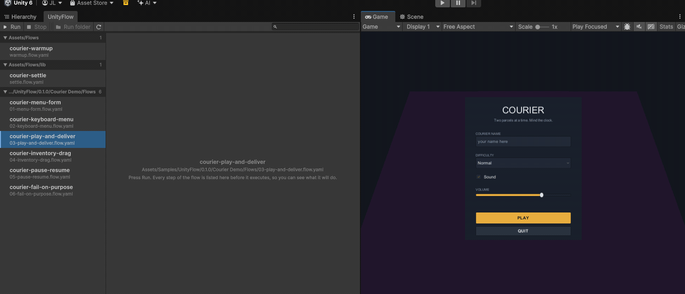

# UnityFlow



*Two real runs of the Courier sample: `03-play-and-deliver` walks the courier to the depot and
passes, then `06-fail-on-purpose` fails on the assertion it was written to break.*

Write a `.flow.yaml`, run one command, and the Unity Editor drives your game and reports structured
pass/fail — with the UI tree, the console output and a screenshot attached to every failure.

```yaml
name: open-settings
requires: { input: system }

steps:
  - waitFor:       { name: MainMenu, timeout: 30s }
  - tapOn:         { text: Settings }
  - assertVisible: { name: SettingsPanel, timeout: 10s }
  - screenshot:    settings-open
```

A real virtual pointer lands on the button, the hit is verified against the live `EventSystem`
raycast, and the game's own click path runs. Nothing calls a game method directly, so if a panel
covers the button the step **fails** — which is the behaviour you want from a UI test.

UnityFlow is an **Editor tool**. It drives the editor (in play mode or edit mode) on your machine;
it is not a device farm and it does not ship into your player build.

---

## Install

UnityFlow is two pieces: a Unity package that lives in the editor, and a small Node CLI that talks
to it.

**1. The package.** Add it to your project's `Packages/manifest.json`:

```json
{
  "dependencies": {
    "com.litwin.unityflow": "https://github.com/juliolitwin/unityflow.git",
    "com.unity.pipeline": "0.3.1-exp.1"
  }
}
```

Or clone the repository and drop it into your project's `Packages/` folder. Requires
**Unity 6000.0+**, [`com.unity.pipeline`](https://docs.unity3d.com/Packages/com.unity.pipeline@0.3)
(the HTTP command surface flows are driven through), the `unity` command-line tool on PATH, and —
for real input injection — the Input System package with `activeInputHandler` set to *Input System*
or *Both*.

**2. Check it.**


```sh
cd path/to/your/UnityProject
unity command flow.doctor
```

`doctor` tells you exactly what would stop a flow from working, in the order you should fix it: no
editor listening, no UI backend, no input driver, an unfocused Game View, a `[FlowCommand]` name
collision. Fix what it names, then run a flow:

```sh
unity command flow.run --file Flows/open-settings.flow.yaml --budgetMs 120000
```

---

## A runnable example

Nothing about this example needs code in your project. Build a scene with a Canvas, a Button named
`OpenButton` whose label reads "Open", and a panel GameObject named `SettingsPanel` that the button
activates. Save it as `Assets/Scenes/Sample.unity`. Then write `Flows/sample.flow.yaml`:

```yaml
name: sample
requires: { input: system }

env:
  panel: SettingsPanel

before:
  # Entering play mode reloads the domain, so a flow that does this must be started
  # with --start (see Constraints).
  - enterPlayMode: Assets/Scenes/Sample.unity

steps:
  - waitFor:          { name: OpenButton, timeout: 30s }
  - assertNotVisible: { name: "${panel}" }

  - tapOn:            { text: Open }
  - assertVisible:    { name: "${panel}", timeout: 10s }
  - screenshot:       01-panel-open

  # A game-state assertion: same retry loop, but about what the game believes
  # rather than about what is on screen.
  - assert:           { find: "${panel}", component: Canvas, field: enabled, is: true }

after:
  - exitPlayMode
```

```sh
unity command flow.start --file Flows/sample.flow.yaml --budgetMs 120000
unity command flow.start --file Flows/sample.flow.yaml --env '["panel=OtherPanel"]'
```

Discover selectors instead of guessing at them:

```sh
unity command flow.snapshot --visibleOnly true        # what is actually on screen right now
unity command flow.snapshot --text Open           # every node whose visible text contains "Open"
unity command flow.probe --component Health --find Player   # every readable member, with its value
unity command flow.commands                       # every verb available in YOUR project
```

---

## Does this need C#?

The honest table. UnityFlow's claim is "author UI tests without writing C#", not "test anything
without writing C#".

| | needs C#? |
|---|---|
| UI, navigation, input, visual asserts | **no** |
| stable selectors | **no** — an optional `FlowTestId` component, assigned in the Inspector |
| game-state asserts | **no, when the declarative query covers it** — `assert` / `waitUntil` read any field or property by name, and `expr:` reaches statics and state that lives off components; anything outside that needs a command |
| arbitrary game setup ("give the player a sword and 300 gold") | **yes**, and it is opt-in via `[FlowCommand]` |

`FlowTestId` is a pure data marker: no `Awake`, no `Update`, no registry. Attaching it is Inspector
work, not programming. `[FlowCommand]` is a marker attribute with no dependencies — it is the only
part of UnityFlow that ships into a player build, and annotating game code never drags the runner in
with it.

---

## Constraints you have to design around

These are not bugs and they are not going away. Each one is a property of the Unity Editor that the
tool is honest about rather than papering over.

### 1. The editor is unreachable while a run is in flight

The pipeline package's HTTP server is **strictly serial**. While `flow.run` is being served, no other
command is answered at all and `unity status` reports *unreachable*. This is measured, not assumed.

* **Progress is a file.** The runner appends to `<project>/.unityflow/runs/<runId>/progress.ndjson`
  and flushes after every line. The host CLI tails it. Do not poll the editor.
* **Cancel is a file.** `unityflow cancel <runId>` writes `<runId>/cancel`; the runner checks for it
  at every step boundary. Ctrl-C writes the same sentinel before exiting.
* **`unity command flow.status <runId>` reads `status.json` from disk** and works while the editor is busy —
  which is exactly when you want it.

### 2. Entering play mode causes a domain reload

Unless `EditorSettings.enterPlayModeOptionsEnabled` is on (it is off by default, and most projects
with non-reload-safe statics keep it off), entering play mode performs a full domain reload. That
destroys every static, the HTTP server, the in-flight request and the bearer token.

* A flow that is **already in play mode** runs fine under `unity command flow.run --file <flow>`.
* A flow that **enters play mode itself** (the `enterPlayMode` verb) must be started with
  **`unity command flow.start --file <flow>`**. It survives the reload by keeping its state in
  `UnityEditor.SessionState` instead of dying with the request that launched it. Plain `run` refuses
  such a flow up front and names the command to use; a reload that happens anyway is reported as
  `interrupted by a domain reload`, exit 2.

The same applies to a script recompile mid-run. **Do not edit C# while a flow is running.**

### 3. Occlusion is only fully verified in play mode

Occlusion fidelity is reported in the run header and in `status.json`, because "the tap landed" is
worth different things at different fidelities:

| fidelity | what was checked |
|---|---|
| `CrossSurface` | a full raycast through the live `EventSystem` — anything on top is caught. **Play mode only.** |
| `PerElement` | the node's own raycast filters (`CanvasGroup.blocksRaycasts`, `Mask`, `RectMask2D`, alpha hit test). Nothing rules out another surface on top. This is all edit mode can offer: `EventSystem` is not `[ExecuteAlways]`, so `EventSystem.current` stays null and `GraphicRaycaster` returns zero hits. |
| `None` | nothing was checked. |

In edit mode `tapOn` therefore **refuses to tap** and fails the step with:

> refusing to tap …: occlusion could not be verified. A tap that is not occlusion-checked can
> silently succeed through a modal, which is how a test goes green on broken UI.

Enter play mode, or accept the risk explicitly with `allowUnverifiedOcclusion: true` on the step (or
`unity command flow.run --file --allow-unverified-occlusion`). There is no quiet fallback.

### 4. Screenshots need a real backbuffer, and a Free Aspect Game View

`screenshot` grabs the actual backbuffer with `ScreenCapture`, not a single camera render, because a
camera render omits every `ScreenSpaceOverlay` canvas — and a UI test whose failure screenshot has no
UI in it is worse than no screenshot. Two consequences:

* It needs **play mode and a graphics device**. Under `-nographics` the step refuses rather than
  writing a blank PNG that reads as "the screen was empty".
* Keep the Game View on **Free Aspect**. A fixed aspect ratio letterboxes the view, so the captured
  backbuffer and the coordinates a flow injects at no longer describe the same rectangle.

### 5. Input requires play mode and a live EventSystem

`requires: { input: system }` demands real device injection. When it is unavailable the flow is
**refused**, loudly, rather than quietly downgraded to poking `Button.onClick` and reporting a green
result that means far less than the reader thinks. `unity command flow.doctor` prints the full diagnosis,
including the one that catches people out: injected input discarded because the Game View is
unfocused. The runner's input session sets
`editorInputBehaviorInPlayMode = AllDeviceInputAlwaysGoesToGameView`,
`backgroundBehavior = IgnoreFocus` and `Application.runInBackground = true` for the duration of the
run, which is what makes an unfocused, CI-shaped editor work at all.

---

## Anatomy of a flow

```yaml
name: my-flow                 # required
requires: { input: system }   # 'system' = real device injection, 'semantic' = synthesized UI events
timeScale: 1.0                # optional
seed: 12345                   # optional

env:                          # optional — variable DEFAULTS, overridable per run
  account: demo
  character: ""

before:  [ ... ]              # setup
steps:   [ ... ]              # the flow proper (required, at least one step)
after:   [ ... ]              # teardown — runs even when the body failed
```

**Parameters.** `${name}` is substituted from `env:` into every string in the file — selector
fields, arguments, screenshot names, `runScript` bodies — and `--env '["name=value`"]' overrides a default
for one run:

```yaml
- inputText: { name: Input, within: { name: AccountField }, text: "${account}" }
```

```sh
unity command flow.run --file Flows/login.flow.yaml --env '["account=someone"]' --env '["password=secret"]'
```

Substitution happens at **parse time**, so a misspelled `${charater}` fails in milliseconds with a
`file:line:column` and the list of names that ARE defined, instead of ninety seconds into a run. An
undefined variable is never an empty string, and an `--env` naming something the flow does not
declare is refused rather than ignored — a variable that quietly resolved to nothing is how a flow
types `""` into a login field and reports a pass for a session it never had. Write a literal
dollar-brace as `$${`, mirroring the `@@` that escapes a literal `@`.

A step is a verb with its arguments. Every verb also accepts three modifiers written next to those
arguments: `timeout`, `on` (disambiguates which object a `[FlowCommand]` acts on) and `as` (binds
the resolved node to a name, referenced later as `"@name"`).

**Selectors** are `testId`, `text` / `contains` / `matches`, `name`, `path` and `type`, narrowed by
`within`, `index` and `backend`. Resolution priority is testId, visible text, name, hierarchy path.

Two rules do most of the work:

* **Ambiguity is a failure, never "take the first."** If `Input` is the node name of both the
  account and the password field, a bare `name: Input` matches two nodes and the resolver refuses
  it. `within: { name: AccountField }` settles it. Silently taking the first match is the single
  largest source of tests that pass while pointing at the wrong node.
* **Everything retries every frame.** `waitFor`, `tapOn` and the assertions re-check on each pumped
  frame until their timeout, which costs nothing — no polling interval, no round trip. Network
  latency, async loads and fade-ins are absorbed for free. This is why a well-written flow contains
  no `wait: 2s`.

`assertNotVisible` inverts the retry semantics on purpose: it requires the condition to **hold** for
a window (500ms by default), because a negative assertion that returns the instant it looks true is
vacuous — a popup that appears 300ms later would still show green.

### Verbs

`tapOn`, `inputText`, `drag`, `press`, `navigateTo`, `submit`, `cancel`, `waitFor`,
`waitUntilNotVisible`, `assertVisible`, `assertNotVisible`, `assertText`, `assert`, `waitUntil`,
`screenshot`, `wait`, `runScript`, `runFlow`, `enterPlayMode`, `exitPlayMode`, plus every
`[FlowCommand]` in your project.

`press`, `navigateTo`, `submit` and `cancel` are the keyboard/controller half. `navigateTo` reaches
an element the way a player without a mouse has to — real arrow keys through uGUI's own navigation
graph, one press per frame, re-reading `EventSystem.current.currentSelectedGameObject` after each —
and it never calls `SetSelectedGameObject` to get closer. When it cannot get there it reports the
path the selection actually took and the `Selectable.navigation` field that stopped it, so an
element no keyboard can reach shows up as the accessibility bug it is:

```yaml
- navigateTo: { name: SlotTwo }
- submit:     { name: SlotTwo }     # asserts SlotTwo IS the selection, then sends Enter
```

`assert` and `waitUntil` are the declarative game-state query — the UI verbs check what is on
screen, these check what the game actually believes:

```yaml
- waitUntil: { find: Player, component: PlayerController, field: isGrounded, is: true }
- assert:    { find: Player, component: Health, field: current, gt: 0, stableFor: 500ms }
- assert:    { count: Monster, gte: 3 }
```

`unity command flow.probe --component Health --find Player` lists the members and their current values, so
nobody has to guess that the field is `m_Current` and not `current`. State that does not live on a
component at all — an ECS world, a static, a plain C# service — is reached through the query's
`expr:` escape hatch.

Run **`unity command flow.commands`** for the authoritative list in your project, with argument types — it is
generated from the same vocabulary the parser validates against, so a typo fails in milliseconds at
parse time instead of halfway through a run.

---

## What a failure looks like

You get the diagnosis, not just the timeout:

```
  ✗ waitFor name=LoginPanel                                   60011ms

      Flows/login.flow.yaml:7
      waitFor name=LoginPanel timed out after 60s: name=LoginPanel matched no VISIBLE node,
      but 1 hidden node(s) match. First: .../UIRoot/Content/LoginPanel
      — GameObject 'LoginPanel' is inactive

        UI snapshot at failure:
          .../UIRoot/AgeRating/Badge  visible
          .../UIRoot/AgeRating/Badge/Warning  "Playing for more than 180 minutes..."  visible
          .../LoginPanel/SubmitButton  "Log In"  hidden (inactive because ancestor 'LoginPanel' is inactive)
          ... 174 more nodes not shown

      screenshot ...\.unityflow\runs\login-02\artifacts\fail-00.png
```

"It exists at alpha 0" and "it does not exist" need completely different fixes, so hidden nodes are
reported **with the reason they are hidden**. Here a splash screen never dismissed, which the
snapshot says in its first line.

---

## Extending it

### Stable ids, without code

Attach **UnityFlow → Flow Test Id** to a GameObject and type an id. Use it only where names and
paths are genuinely unstable — procedurally generated lists, localized labels, prefabs designers
rename.

```yaml
- tapOn: { testId: shop.item.sword }
```

### Game setup, opt-in

```csharp
public class PlayerWallet : MonoBehaviour
{
    [SerializeField] int money;

    [FlowCommand("giveCoins", Description = "Add coins to the player's wallet.")]
    public void GiveCoins(int amount) => money += amount;
}
```

```yaml
- giveCoins: 300
```

An **instance** method solves the reference problem by construction: `this` is the object the step
acts on, so the flow never names it. The runner finds the component in the scene and follows the
same 0 / 1 / N-fails rule as selector resolution — two wallets in the scene and a bare `giveCoins`
is an ambiguity you settle with `on:`, because picking one would make the flow pass while testing
the wrong object.

Return `void`, `IEnumerator` or `Task`. Returning `IEnumerator` matters: the runner yields on it, so
a scene load or an animation is awaited properly instead of degrading into a guessed `wait: 2s`.

A `[FlowCommand]` name that collides with a built-in verb (or another command) makes **both**
unavailable and is reported by `doctor` and `commands`. Shadowing would silently change what an
existing flow does.

---

## What UnityFlow deliberately does not do

* **No device farm.** It drives the Editor and a development Player on this machine. There is no
  fleet, no cloud, no matrix of physical devices.
* **No pixel diffing.** Screenshots are evidence attached to a failure, not an assertion mechanism.
  Golden-image comparison is a different tool with a different maintenance burden.
* **It is not a Unity Test Framework replacement.** UTF owns unit and integration tests in C#;
  UnityFlow owns end-to-end flows through the real UI. Keep both.
* **No per-step round trips.** The whole flow runs inside the editor. Driving it step-by-step from
  the host would turn a `waitFor` polling at 100ms for 5s into 50 process spawns and 50 HTTP
  requests; in here the same wait is 300 frames that cost nothing.
* **No silent degradation.** Every capability — write mode, occlusion fidelity, input driver — is
  negotiated once, printed in the run header, and never varied mid-run. A flow that cannot be run
  faithfully is refused, not downgraded.

---

## Where things live

```
Editor/Core/        the frozen contract: backends, selectors, handles, capabilities
Editor/Backends/    uGUI enumeration and hit-testing; Input System device injection
Editor/Model/       parsed flow documents, steps, selectors
Editor/Yaml/        the parser — positioned errors, exhaustive validation
Editor/Runner/      the interpreter, the frame driver, the step library, NDJSON progress, resume
Editor/State/       the declarative game-state query behind 'assert' and 'waitUntil'
Editor/PlayMode/    entering and leaving play mode across a domain reload
Editor/Commands/    the flow.* CLI surface
Editor/Capture/     screenshots
Editor/Report/      the console ring buffer attached to every failure
Runtime/            FlowCommandAttribute and FlowTestId — the only things a build sees
Tests/Editor/       EditMode tests for the parser, resolver, binder and rect math
```

Runs are written outside `Assets/` so nothing is imported as an asset (a `.png` under `Assets/`
would trigger a texture import on every screenshot):

```
<project>/.unityflow/runs/<runId>/
    progress.ndjson    append-only event stream, flushed per line
    status.json        atomic snapshot; survives a domain reload
    cancel             the sentinel the host writes
    artifacts/         screenshots, failure captures
```

Add `.unityflow/` to `.gitignore`.

See [`Documentation~/index.md`](Documentation~/index.md) for the full YAML reference and the
architecture notes, and [`CHANGELOG.md`](CHANGELOG.md) for what changed.

---

## Licence

UnityFlow is licensed under the **PolyForm Perimeter License 1.0.0** — the full text is in
[`LICENSE.md`](LICENSE.md). In one paragraph: you may use, modify and redistribute it for any
purpose, including inside a commercial product — test your paid game with it, ship your game, put it
in your CI, fork it and change it, all without asking and without paying. The one thing you may not
do is build a competing product out of it: you cannot take UnityFlow and offer it (or something that
substitutes for it) to others as a testing tool, service, library or plug-in, free or paid. If you
redistribute any part of it you must pass along a copy of the licence, or its URL, together with the
`Required Notice:` line it carries. Testing your own software with UnityFlow is never competing with
it.

Third-party components are listed in [Third Party Notices.md](Third%20Party%20Notices.md):
YamlDotNet 18.1.0 (MIT, vendored), and four sites in the uGUI backend derived from Unity's own
`com.unity.ugui` under the Unity Companion License.
